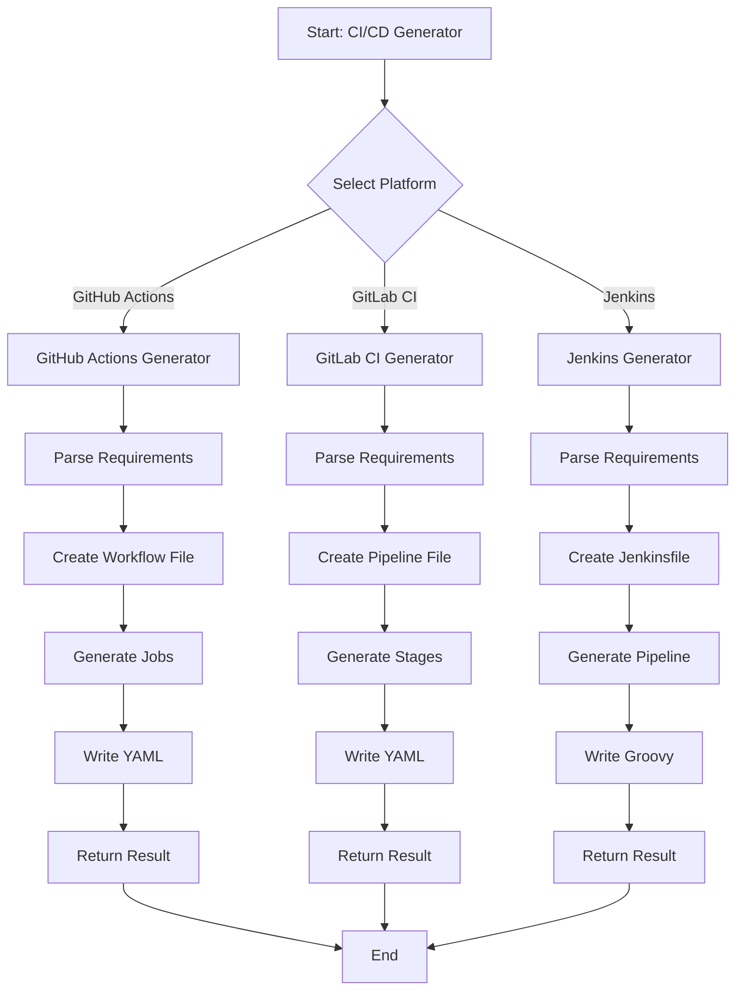
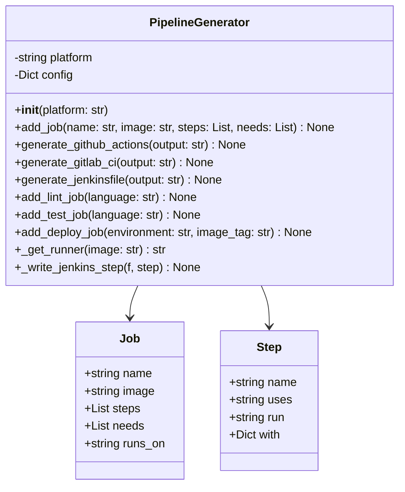
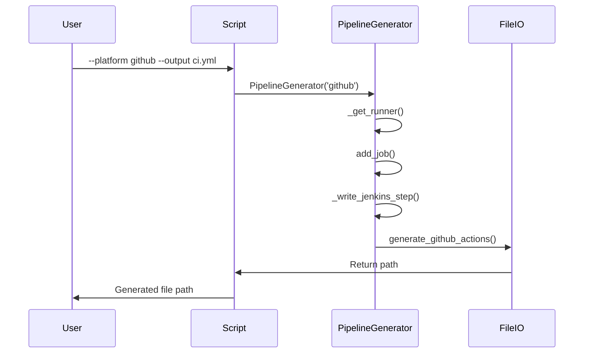

# cicd_generator.py

## Overview

The `cicd_generator.py` script generates CI/CD pipeline configurations for popular platforms including GitHub Actions, GitLab CI, and Jenkins. It provides automated pipeline creation with support for multiple stages and jobs.

## Features

- GitHub Actions workflow generation
- GitLab CI configuration generation
- Jenkins pipeline generation
- Customizable job templates
- Environment-specific configurations
- Multi-stage pipeline support

## Mermaid Diagram



## Usage

### Generate GitHub Actions Workflow

```bash
python scripts/cicd_generator.py \
    --platform github \
    --output .github/workflows/ci.yml \
    --add-lint \
    --add-test \
    --add-deploy
```

### Generate GitLab CI Configuration

```bash
python scripts/cicd_generator.py \
    --platform gitlab \
    --output .gitlab-ci.yml \
    --add-lint \
    --add-test
```

### Generate Jenkins Pipeline

```bash
python scripts/cicd_generator.py \
    --platform jenkins \
    --output Jenkinsfile \
    --add-lint \
    --add-deploy
```

### With Custom Configuration

```bash
python scripts/cicd_generator.py \
    --platform github \
    --output .github/workflows/ci.yml \
    --add-lint \
    --add-test \
    --add-deploy \
    --language python \
    --environment production \
    --image-tag v1.0.0
```

## Commands

### GitHub Actions

```bash
python scripts/cicd_generator.py \
    --platform github \
    --output .github/workflows/ci.yml \
    --add-lint \
    --add-test \
    --add-deploy
```

### GitLab CI

```bash
python scripts/cicd_generator.py \
    --platform gitlab \
    --output .gitlab-ci.yml \
    --add-lint \
    --add-test
```

### Jenkins

```bash
python scripts/cicd_generator.py \
    --platform jenkins \
    --output Jenkinsfile \
    --add-lint \
    --add-deploy
```

## Architecture



## Workflow



## GitHub Actions Workflow

### Example Output

```yaml
name: CI/CD Pipeline
on:
  push:
    branches: [main, master, develop]
  pull_request:
    branches: [main, master]

jobs:
  lint:
    runs-on: ubuntu-latest
    steps:
      - uses: actions/checkout@v3
      - run: npm run lint

  test:
    runs-on: ubuntu-latest
    steps:
      - uses: actions/checkout@v3
      - run: npm install
      - run: npm test

  deploy:
    needs: [lint, test]
    runs-on: ubuntu-latest
    steps:
      - uses: actions/checkout@v3
      - run: kubectl apply -f k8s/production
```

## GitLab CI Configuration

### Example Output

```yaml
name: CI/CD Pipeline

stages:
  - lint
  - test
  - deploy

variables:
  IMAGE_TAG: $CI_REGISTRY_IMAGE:$CI_COMMIT_SHORT_SHA
  DOCKER_DRIVER: overlay2

lint:
  stage: lint
  image: node:20
  script:
    - npm run lint

test:
  stage: test
  image: node:20
  script:
    - npm install
    - npm test

deploy:
  stage: deploy
  image: node:20
  script:
    - kubectl apply -f k8s/production
  only:
    - main
```

## Jenkins Pipeline

### Example Output

```groovy
pipeline {
    agent {
        label 'node'
    }
    stages {
        stage('Checkout') {
            steps {
                git url: 'git@github.com:myorg/myrepo.git', branch: 'main'
            }
        }
        stage('Lint') {
            steps {
                sh 'npm run lint'
            }
        }
        stage('Test') {
            steps {
                sh 'npm install'
                sh 'npm test'
            }
        }
    }
    post {
        always {
            cleanWs()
        }
    }
}
```

## Configuration

### Language Support

- JavaScript/Node.js
- Python
- Go
- Ruby
- Java

### Environment Support

- Development
- Staging
- Production

## Return Codes

- `0`: Success
- `1`: Error

## Dependencies

- Python 3.7+
- PyYAML

## Examples

### Complete Pipeline

```bash
# Generate GitHub Actions pipeline
python scripts/cicd_generator.py \
    --platform github \
    --output .github/workflows/ci.yml \
    --add-lint \
    --add-test \
    --add-deploy \
    --language python \
    --environment production \
    --image-tag v1.0.0

# Generate GitLab CI pipeline
python scripts/cicd_generator.py \
    --platform gitlab \
    --output .gitlab-ci.yml \
    --add-lint \
    --add-test

# Generate Jenkins pipeline
python scripts/cicd_generator.py \
    --platform jenkins \
    --output Jenkinsfile \
    --add-lint \
    --add-deploy
```

## Best Practices

1. **Separate** lint, test, and deploy stages
2. **Use** matrix testing for multiple languages/versions
3. **Add** caching for build dependencies
4. **Configure** environment variables
5. **Include** notifications for pipeline status
6. **Use** required checks for main branch
