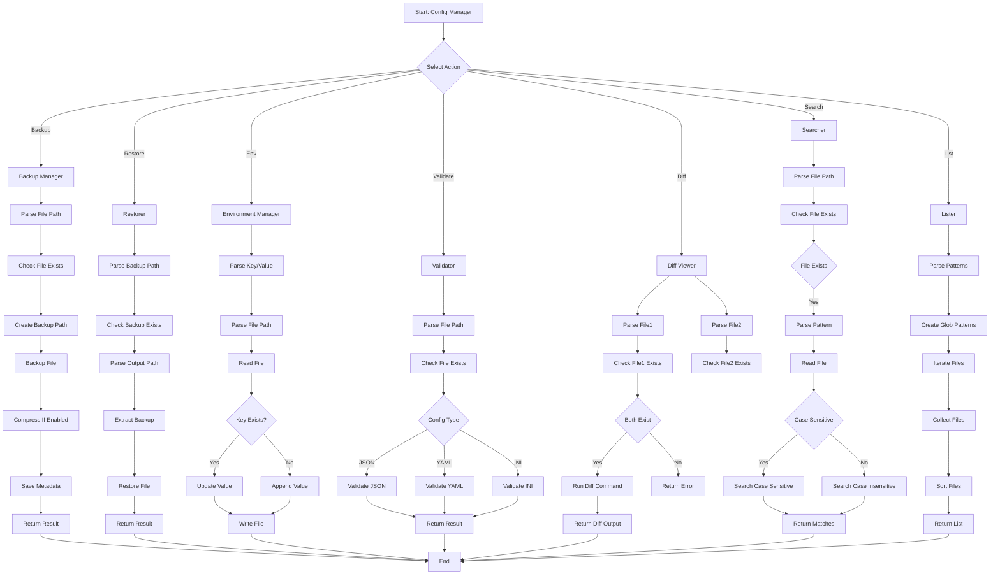
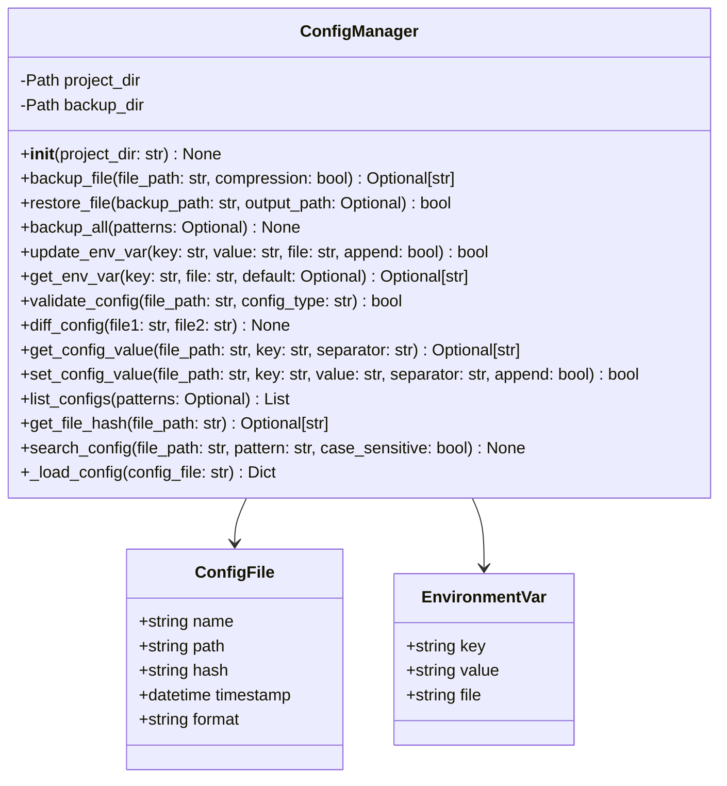
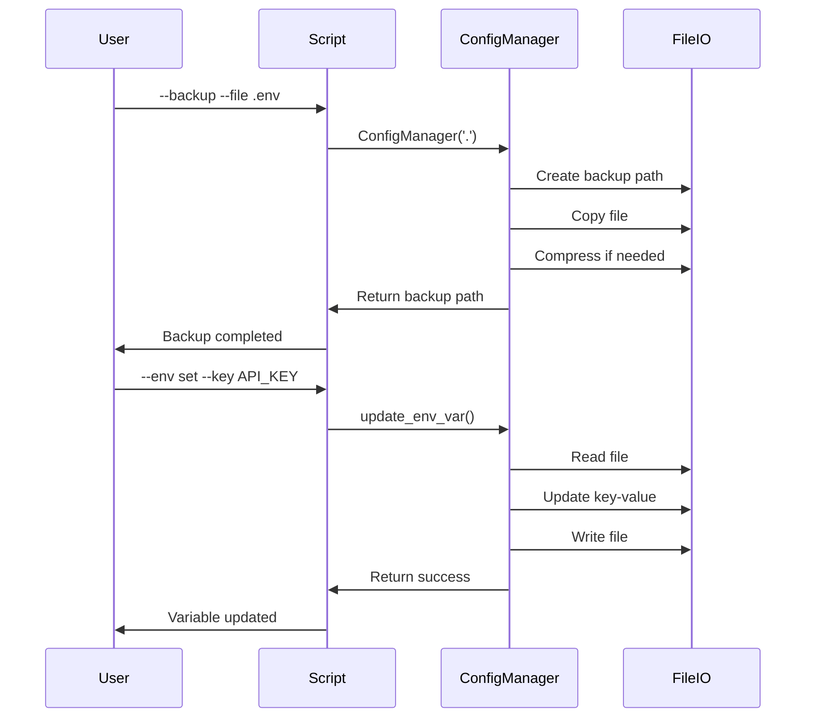

# config_manager.py

## Overview

The `config_manager.py` script provides comprehensive configuration file management. It handles backup, restore, environment variable management, file validation, searching, and diffing of configuration files.

## Features

- Configuration file backup and restore
- Environment variable management
- File validation (JSON, YAML, INI)
- Config searching and diffing
- Backup history management
- Custom configuration support

## Mermaid Diagram



## Usage

### Backup File

```bash
python scripts/config_manager.py \
    backup \
    --file .env \
    --all
```

### Restore File

```bash
python scripts/config_manager.py \
    restore \
    --file .env.backup.tar.gz \
    --output .env
```

### Set Environment Variable

```bash
python scripts/config_manager.py \
    env \
    set \
    --key API_KEY \
    --value secret123 \
    --file .env
```

### Set with Append

```bash
python scripts/config_manager.py \
    env \
    set \
    --key NEW_KEY \
    --value new_value \
    --file .env \
    --append
```

### Get Environment Variable

```bash
python scripts/config_manager.py \
    env \
    get \
    --key API_KEY \
    --file .env \
    --default default_value
```

### Validate Config File

```bash
python scripts/config_manager.py \
    validate \
    --file config.yaml \
    --type yaml
```

### Diff Files

```bash
python scripts/config_manager.py \
    diff \
    --file1 config1.yaml \
    --file2 config2.yaml
```

### Search Config File

```bash
python scripts/config_manager.py \
    search \
    --file config.yaml \
    --pattern DATABASE_URL \
    --case-sensitive
```

### List Config Files

```bash
python scripts/config_manager.py \
    list \
    --pattern .env* config.*
```

## Commands

### Backup

```bash
python scripts/config_manager.py \
    backup \
    --file .env \
    --all
```

### Restore

```bash
python scripts/config_manager.py \
    restore \
    --file backup.tar.gz \
    --output .env
```

### Env Set

```bash
python scripts/config_manager.py \
    env \
    set \
    --key KEY \
    --value VALUE \
    --file .env
```

### Env Get

```bash
python scripts/config_manager.py \
    env \
    get \
    --key KEY \
    --file .env \
    --default default
```

### Validate

```bash
python scripts/config_manager.py \
    validate \
    --file config.yaml \
    --type yaml
```

### Diff

```bash
python scripts/config_manager.py \
    diff \
    --file1 config1.yaml \
    --file2 config2.yaml
```

### Search

```bash
python scripts/config_manager.py \
    search \
    --file config.yaml \
    --pattern PATTERN
```

### List

```bash
python scripts/config_manager.py \
    list \
    --pattern .env*
```

## Architecture



## Workflow



## Supported Config Formats

### JSON

```json
{
  "database": {
    "url": "postgres://localhost:5432"
  }
}
```

### YAML

```yaml
database:
  url: postgres://localhost:5432
  name: mydb
```

### INI

```ini
[database]
url=postgres://localhost:5432
name=mydb
```

### Environment Variables

```bash
DATABASE_URL=postgres://localhost:5432
DATABASE_NAME=mydb
```

## Configuration Files

### .env

```bash
API_KEY=your_api_key
DATABASE_URL=postgres://localhost:5432
DATABASE_NAME=mydb
```

### config.yaml

```yaml
app:
  name: myapp
  version: 1.0.0

database:
  host: localhost
  port: 5432
  name: mydb
```

## Backup Locations

### Default Backup Directory

```bash
./.config_backups
```

### Custom Directory

```bash
python scripts/config_manager.py \
    backup \
    --file .env \
    --project /custom/path
```

## Compression

### Enable Compression

```json
{
  "compression": true
}
```

### Disable Compression

```json
{
  "compression": false
}
```

## Return Codes

- `0`: Success
- `1`: Error

## Dependencies

- Python 3.7+
- PyYAML
- configparser
- tarfile
- hashlib

## Examples

### Complete Configuration Workflow

```bash
# Backup .env file
python scripts/config_manager.py \
    backup \
    --file .env

# Backup all config files
python scripts/config_manager.py \
    backup \
    --all

# Set environment variable
python scripts/config_manager.py \
    env \
    set \
    --key API_KEY \
    --value secret123 \
    --file .env

# Get environment variable
python scripts/config_manager.py \
    env \
    get \
    --key API_KEY \
    --file .env

# Validate config file
python scripts/config_manager.py \
    validate \
    --file config.yaml \
    --type yaml

# Diff config files
python scripts/config_manager.py \
    diff \
    --file1 config1.yaml \
    --file2 config2.yaml

# Search config file
python scripts/config_manager.py \
    search \
    --file config.yaml \
    --pattern DATABASE

# List config files
python scripts/config_manager.py \
    list \
    --pattern .env* config.*
```

## Best Practices

1. **Backup frequently** - Backup before making changes
2. **Organize backups** - Use timestamped backup names
3. **Encrypt sensitive data** - Protect sensitive configurations
4. **Use environment variables** - For sensitive data
5. **Validate configuration** - Before deployment
6. **Document changes** - Keep track of configuration changes
7. **Use version control** - Track config files
8. **Separate environments** - Different configs for dev/prod
9. **Test restores** - Ensure backups are valid
10. **Clean up old backups** - Remove unused backups
