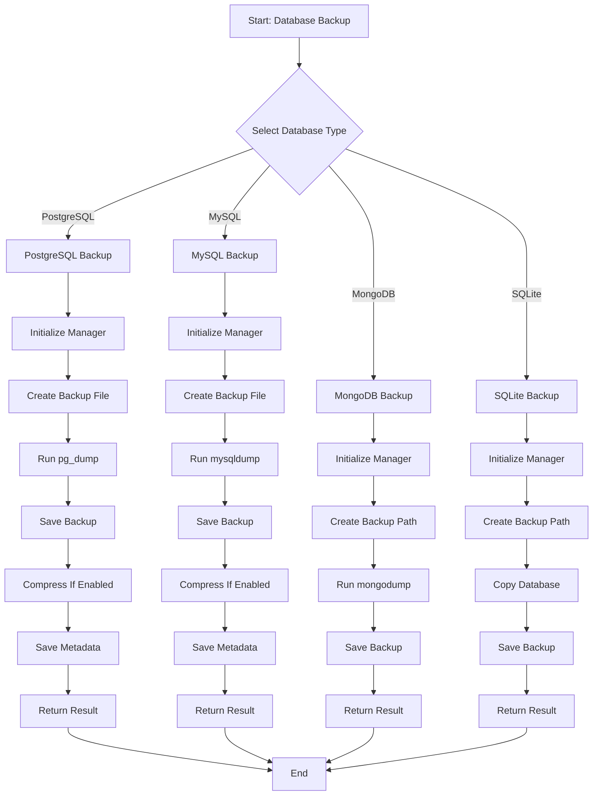
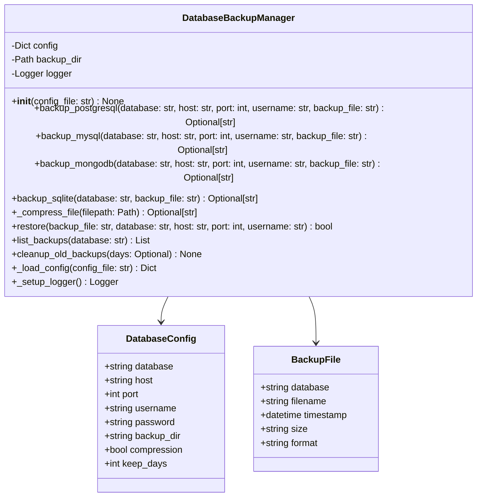
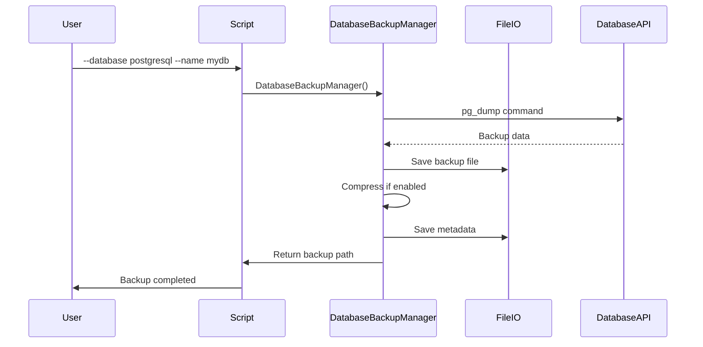

# database_backup.py

## Overview

The `database_backup.py` script provides comprehensive database backup and restore operations. It supports PostgreSQL, MySQL, MongoDB, and SQLite databases with features for backup compression, automated cleanup, and restoration capabilities.

## Features

- Multi-database support (PostgreSQL, MySQL, MongoDB, SQLite)
- Backup compression
- Restore operations
- Backup history management
- Automated cleanup
- Configuration management
- Logging

## Mermaid Diagram



## Usage

### PostgreSQL Backup

```bash
python scripts/database_backup.py \
    --database postgresql \
    --name mydb \
    --user postgres
```

### MySQL Backup

```bash
python scripts/database_backup.py \
    --database mysql \
    --name mydb \
    --user root
```

### MongoDB Backup

```bash
python scripts/database_backup.py \
    --database mongodb \
    --name mydb
```

### SQLite Backup

```bash
python scripts/database_backup.py \
    --database sqlite \
    --name mydb
```

### Restore Backup

```bash
python scripts/database_backup.py \
    --restore mydb_20240101.sql \
    --name mydb
```

### List Backups

```bash
python scripts/database_backup.py \
    --list \
    --name mydb
```

### Cleanup Old Backups

```bash
python scripts/database_backup.py \
    --cleanup \
    --keep-days 7
```

### With Configuration File

```bash
python scripts/database_backup.py \
    --database postgresql \
    --name mydb \
    --config backup-config.json
```

## Commands

### Backup

```bash
python scripts/database_backup.py \
    --database postgresql \
    --name mydb \
    --user postgres
```

### Restore

```bash
python scripts/database_backup.py \
    --restore backup.sql \
    --name mydb
```

### List

```bash
python scripts/database_backup.py \
    --list \
    --name mydb
```

### Cleanup

```bash
python scripts/database_backup.py \
    --cleanup \
    --keep-days 7
```

## Architecture



## Workflow



## Database Types

### PostgreSQL

```bash
--database postgresql --name mydb --user postgres
```

### MySQL

```bash
--database mysql --name mydb --user root
```

### MongoDB

```bash
--database mongodb --name mydb
```

### SQLite

```bash
--database sqlite --name mydb
```

## Configuration

### Configuration File Example

```json
{
  "backup_dir": "backups",
  "compression": true,
  "keep_days": 7
}
```

## Supported Formats

- Plain SQL (.sql)
- Compressed SQL (.sql.gz)
- MongoDB dump (.dump)
- SQLite file (.db, .sqlite)

## Backup Locations

### Default Directory

```bash
./backups
```

### Custom Directory

```bash
python scripts/database_backup.py \
    --database postgresql \
    --name mydb \
    --backup-dir /path/to/backups
```

## Compression

### Enable Compression

```json
{
  "compression": true
}
```

### Disable Compression

```json
{
  "compression": false
}
```

## Return Codes

- `0`: Success
- `1`: Error

## Dependencies

- Python 3.7+
- PostgreSQL client (pg_dump)
- MySQL client (mysqldump)
- MongoDB client (mongodump)
- tar (for compression)

## Examples

### Complete Backup Workflow

```bash
# Backup PostgreSQL database
python scripts/database_backup.py \
    --database postgresql \
    --name production_db \
    --user postgres \
    --backup-file production_20240101.sql

# Backup MySQL database
python scripts/database_backup.py \
    --database mysql \
    --name analytics_db \
    --user root

# Backup MongoDB database
python scripts/database_backup.py \
    --database mongodb \
    --name user_db

# Backup SQLite database
python scripts/database_backup.py \
    --database sqlite \
    --name local_db

# List backups
python scripts/database_backup.py \
    --list \
    --name production_db

# Cleanup old backups (older than 7 days)
python scripts/database_backup.py \
    --cleanup \
    --keep-days 7

# Restore from backup
python scripts/database_backup.py \
    --restore production_20240101.sql \
    --name production_db
```

## Best Practices

1. **Regular backups** - Schedule automated backups
2. **Test restores** - Verify backup integrity
3. **Multiple copies** - Keep backups in multiple locations
4. **Compression** - Enable for space efficiency
5. **Retention policy** - Set appropriate keep_days
6. **Monitor backups** - Check backup success rates
7. **Encrypt backups** - Protect sensitive data
8. **Document procedures** - Keep backup documentation
