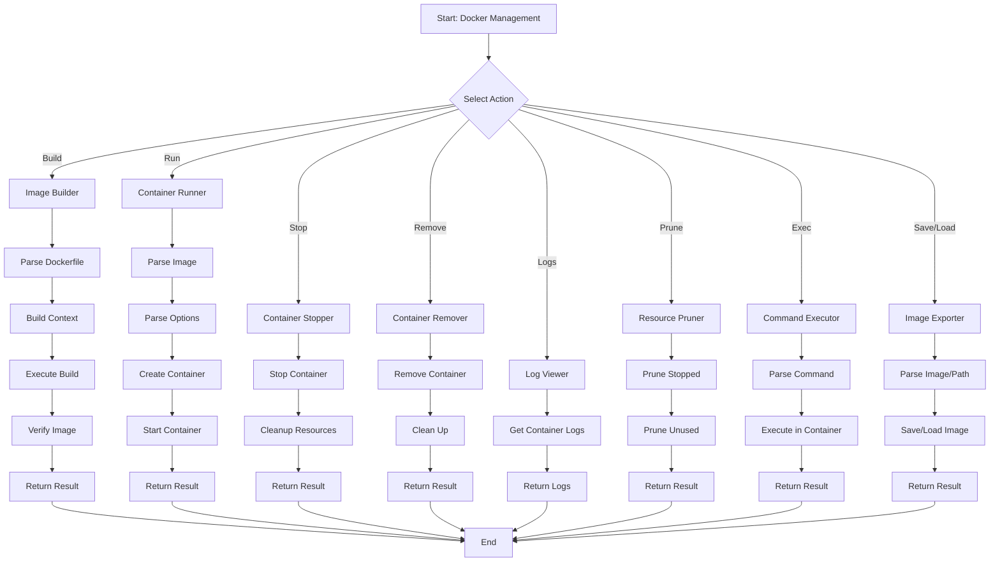
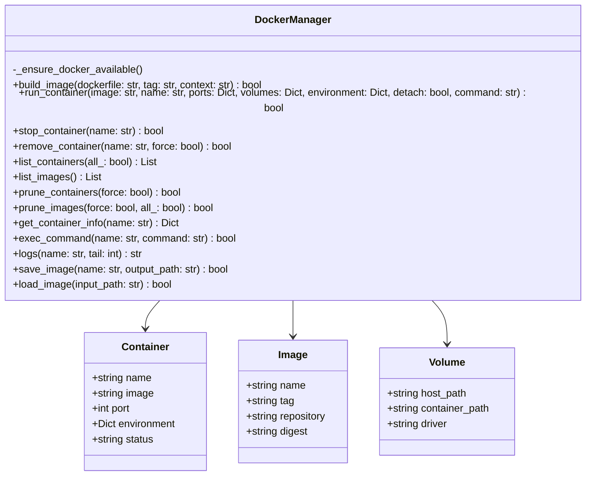
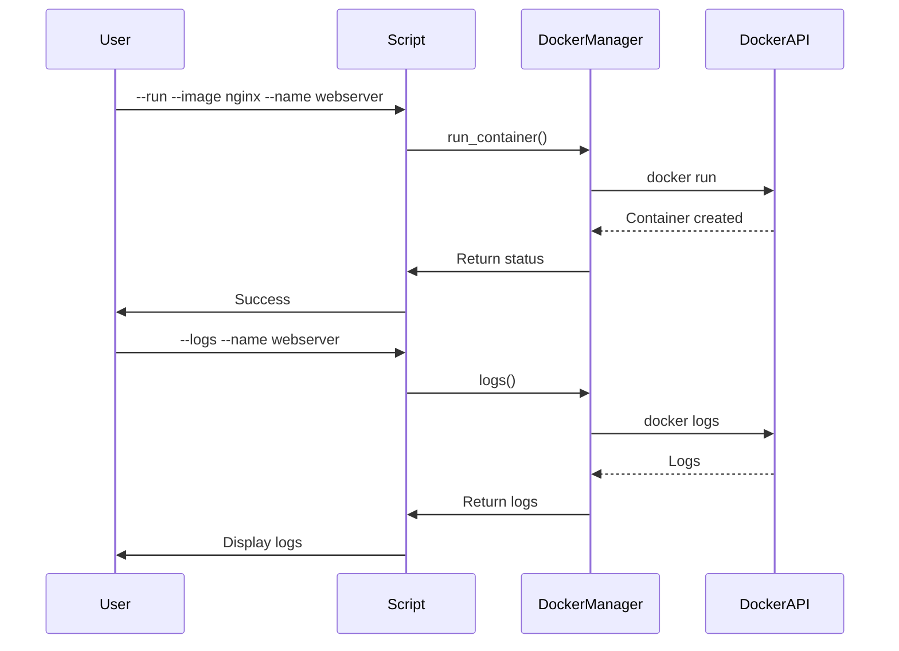

# docker_manager.py

## Overview

The `docker_manager.py` script provides comprehensive Docker container and image management capabilities. It handles the complete lifecycle of Docker containers including creation, removal, logging, and resource cleanup.

## Features

- Container lifecycle management (run, stop, remove)
- Image building and operations
- Container log viewing
- Resource cleanup and pruning
- Container inspection
- Image saving and loading

## Mermaid Diagram



## Usage

### Build an Image

```bash
python scripts/docker_manager.py \
    build \
    --dockerfile Dockerfile \
    --tag myapp:latest \
    --context .
```

### Run a Container

```bash
python scripts/docker_manager.py \
    run \
    --image nginx \
    --name webserver \
    --port 80:80 \
    --detach
```

### Stop a Container

```bash
python scripts/docker_manager.py \
    stop \
    --name webserver
```

### Remove a Container

```bash
python scripts/docker_manager.py \
    remove \
    --name webserver \
    --force
```

### View Logs

```bash
python scripts/docker_manager.py \
    logs \
    --name webserver \
    --tail 100
```

### Prune Resources

```bash
python scripts/docker_manager.py \
    prune \
    --containers \
    --images \
    --force
```

### Execute Command

```bash
python scripts/docker_manager.py \
    exec \
    --name webserver \
    --command 'top -n 5'
```

### Save Image

```bash
python scripts/docker_manager.py \
    save \
    --image myapp:latest \
    --output myapp.tar
```

### Load Image

```bash
python scripts/docker_manager.py \
    load \
    --input myapp.tar
```

## Commands

### Build

```bash
python scripts/docker_manager.py \
    build \
    --dockerfile Dockerfile \
    --tag myapp:v1.0
```

### Run

```bash
python scripts/docker_manager.py \
    run \
    --image nginx:latest \
    --name webserver \
    --port 80:80 \
    --volume /data:/data \
    --env ENV=production
```

### Stop

```bash
python scripts/docker_manager.py \
    stop \
    --name container-name
```

### Remove

```bash
python scripts/docker_manager.py \
    remove \
    --name container-name
```

### Logs

```bash
python scripts/docker_manager.py \
    logs \
    --name container-name \
    --tail 50
```

### Prune

```bash
python scripts/docker_manager.py \
    prune \
    --containers \
    --images \
    --force
```

### Exec

```bash
python scripts/docker_manager.py \
    exec \
    --name container-name \
    --command 'ps aux'
```

### Save

```bash
python scripts/docker_manager.py \
    save \
    --image myapp:latest \
    --output backup.tar
```

### Load

```bash
python scripts/docker_manager.py \
    load \
    --input backup.tar
```

## Architecture



## Workflow



## Configuration

### Environment Variables

- `DOCKER_HOST`: Docker socket or daemon URL
- `DOCKER_TLS_VERIFY`: TLS verification
- `DOCKER_CERT_PATH`: Certificate paths

### Dockerfile Support

```dockerfile
FROM python:3.9-slim
WORKDIR /app
COPY requirements.txt .
RUN pip install -r requirements.txt
COPY . .
CMD ["python", "app.py"]
```

## Container Options

### Ports

```bash
--port 8080:80 --port 443:443
```

### Volumes

```bash
--volume /host/path:/container/path
```

### Environment Variables

```bash
--env KEY=value --env API_KEY=secret
```

### Detached Mode

```bash
--detach
```

## Image Operations

### Build Tags

```bash
--tag myapp:latest
--tag myapp:v1.0
--tag myapp:1.0.0
```

### Save Formats

- `.tar` - Standard tar format
- `.tar.gz` - Compressed tar format

## Return Codes

- `0`: Success
- `1`: Error

## Dependencies

- Python 3.7+
- Docker Engine
- Docker CLI

## Examples

### Complete Docker Setup

```bash
# Build image
python scripts/docker_manager.py \
    build \
    --dockerfile Dockerfile \
    --tag myapp:latest \
    --context .

# Run container
python scripts/docker_manager.py \
    run \
    --image myapp:latest \
    --name myapp \
    --port 8080:8080 \
    --volume /data:/app/data \
    --detach

# View logs
python scripts/docker_manager.py \
    logs \
    --name myapp \
    --tail 50

# Stop container
python scripts/docker_manager.py \
    stop \
    --name myapp

# Save image
python scripts/docker_manager.py \
    save \
    --image myapp:latest \
    --output myapp-backup.tar
```

## Best Practices

1. **Always tag** images with version numbers
2. **Use detached mode** for production containers
3. **Map volumes** for persistent data
4. **Set environment variables** for configuration
5. **Clean up** stopped containers regularly
6. **Monitor** logs for troubleshooting
7. **Backup** important images
