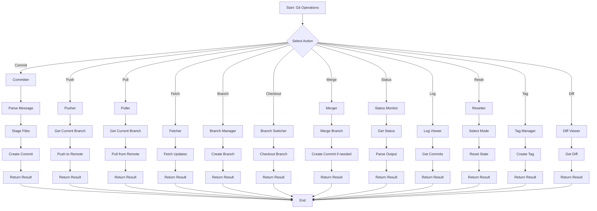
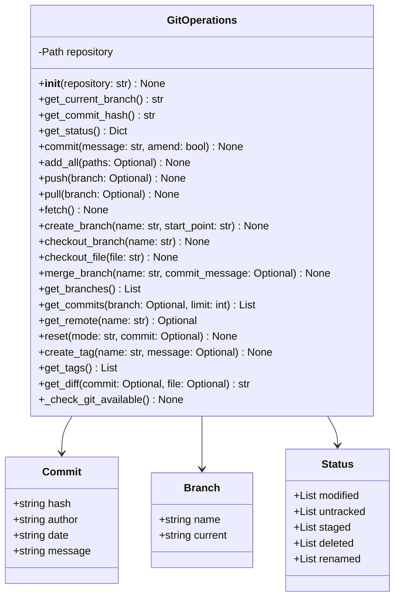
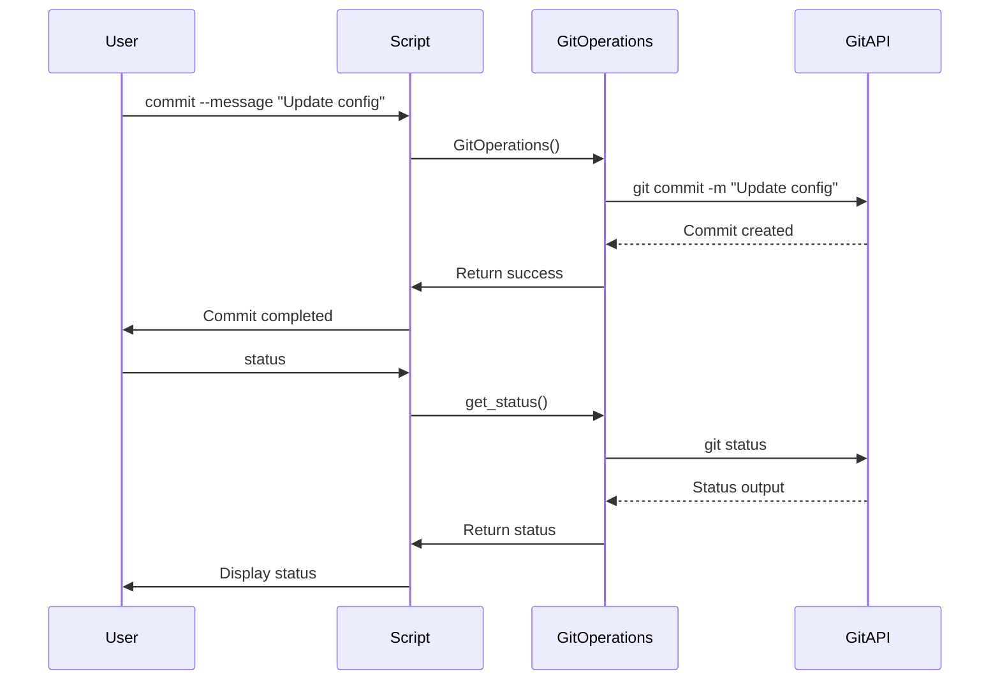

# git_operations.py

## Overview

The `git_operations.py` script provides comprehensive Git workflow automation. It handles common Git operations including commits, pushes, pulls, branch management, status monitoring, and diff viewing.

## Features

- Git workflow automation
- Commit, push, and pull operations
- Branch creation and management
- Status monitoring
- Diff viewing
- Tag management
- Reset operations
- Commit history

## Mermaid Diagram



## Usage

### Commit

```bash
python scripts/git_operations.py \
    commit \
    --message "Update deployment configuration"
```

### Commit with Amend

```bash
python scripts/git_operations.py \
    commit \
    --message "Fix bug in authentication" \
    --amend
```

### Add Files

```bash
python scripts/git_operations.py \
    add \
    --all
```

### Add Specific Files

```bash
python scripts/git_operations.py \
    add \
    --file src/main.py src/utils.py
```

### Push

```bash
python scripts/git_operations.py \
    push \
    --branch main
```

### Pull

```bash
python scripts/git_operations.py \
    pull \
    --branch main
```

### Fetch

```bash
python scripts/git_operations.py \
    fetch
```

### Create Branch

```bash
python scripts/git_operations.py \
    branch \
    --name feature/new-auth
```

### Create Branch from Tag

```bash
python scripts/git_operations.py \
    branch \
    --name feature/new-auth \
    --start-point v1.0.0
```

### Checkout Branch

```bash
python scripts/git_operations.py \
    checkout \
    --branch production
```

### Checkout File

```bash
python scripts/git_operations.py \
    checkout \
    --file src/main.py
```

### Merge Branch

```bash
python scripts/git_operations.py \
    merge \
    --branch develop \
    --message "Merge develop into main"
```

### Get Status

```bash
python scripts/git_operations.py \
    status
```

### View Log

```bash
python scripts/git_operations.py \
    log \
    --branch main \
    --limit 10
```

### Reset

```bash
python scripts/git_operations.py \
    reset \
    --mode mixed
```

### Create Tag

```bash
python scripts/git_operations.py \
    tag \
    --name v1.0.0 \
    --message "Release version 1.0.0"
```

### View Diff

```bash
python scripts/git_operations.py \
    diff \
    --commit HEAD~1 \
    --file src/main.py
```

## Commands

### Commit

```bash
python scripts/git_operations.py \
    commit \
    --message "Your commit message"
```

### Push

```bash
python scripts/git_operations.py \
    push \
    --branch main
```

### Pull

```bash
python scripts/git_operations.py \
    pull \
    --branch main
```

### Branch

```bash
python scripts/git_operations.py \
    branch \
    --name feature-branch
```

### Checkout

```bash
python scripts/git_operations.py \
    checkout \
    --branch production
```

### Merge

```bash
python scripts/git_operations.py \
    merge \
    --branch develop
```

### Status

```bash
python scripts/git_operations.py \
    status
```

### Log

```bash
python scripts/git_operations.py \
    log \
    --limit 10
```

### Reset

```bash
python scripts/git_operations.py \
    reset \
    --mode mixed
```

### Tag

```bash
python scripts/git_operations.py \
    tag \
    --name v1.0.0
```

### Diff

```bash
python scripts/git_operations.py \
    diff \
    --commit HEAD~1
```

## Architecture



## Workflow



## Git Operations

### Stage Files

```bash
# Stage all changes
python scripts/git_operations.py \
    commit \
    --message "Update files" \
    --add --all
```

### Unstage Files

```bash
# Unstage files
git reset HEAD file.txt
```

### Discard Changes

```bash
# Discard changes to file
git checkout -- file.txt
```

## Branch Management

### List Branches

```bash
python scripts/git_operations.py \
    status
```

### Create Feature Branch

```bash
python scripts/git_operations.py \
    branch \
    --name feature/new-feature
```

### Switch Branch

```bash
python scripts/git_operations.py \
    checkout \
    --branch main
```

### Delete Branch

```bash
git branch -d feature/old-branch
```

## Tags

### List Tags

```bash
python scripts/git_operations.py \
    status
```

### Create Tag

```bash
python scripts/git_operations.py \
    tag \
    --name v1.0.0
```

### Push Tags

```bash
git push origin v1.0.0
```

## Reset Modes

### Mixed (Default)

```bash
python scripts/git_operations.py \
    reset --mode mixed
```

### Soft

```bash
python scripts/git_operations.py \
    reset --mode soft
```

### Hard

```bash
python scripts/git_operations.py \
    reset --mode hard
```

## Return Codes

- `0`: Success
- `1`: Error

## Dependencies

- Python 3.7+
- Git (command-line tool)

## Examples

### Complete Git Workflow

```bash
# Stage changes
python scripts/git_operations.py \
    add \
    --all

# Commit changes
python scripts/git_operations.py \
    commit \
    --message "Add new feature"

# Push to remote
python scripts/git_operations.py \
    push \
    --branch main

# Create feature branch
python scripts/git_operations.py \
    branch \
    --name feature/user-auth

# Checkout branch
python scripts/git_operations.py \
    checkout \
    --branch feature/user-auth

# View status
python scripts/git_operations.py \
    status

# View log
python scripts/git_operations.py \
    log \
    --limit 5

# Create tag
python scripts/git_operations.py \
    tag \
    --name v1.0.0 \
    --message "Release version 1.0.0"
```

## Best Practices

1. **Commit frequently** - Small, focused commits
2. **Use meaningful messages** - Clear commit messages
3. **Test before pushing** - Ensure code quality
4. **Use branches** - Feature branches for development
5. **Pull before pushing** - Stay up to date
6. **Review changes** - Check git status
7. **Tag releases** - Mark important versions
8. **Clean history** - Remove merged branches
