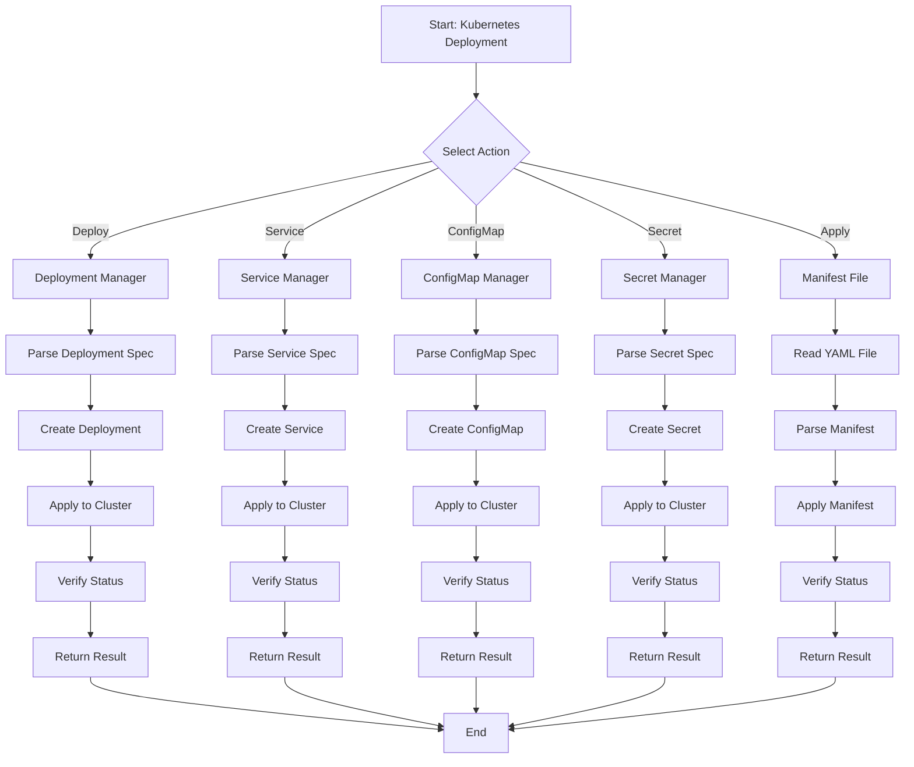
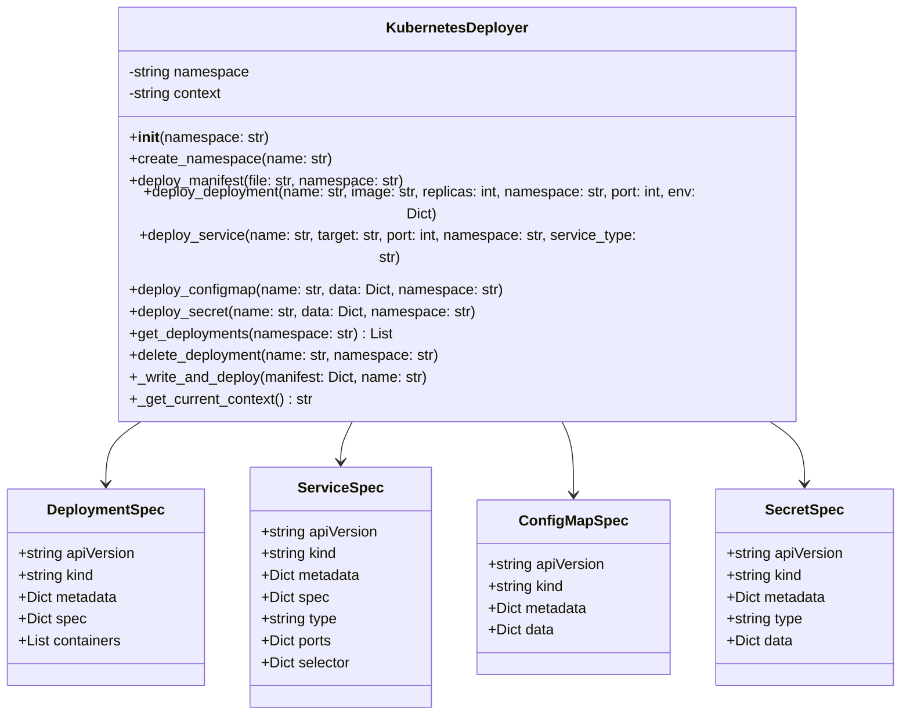
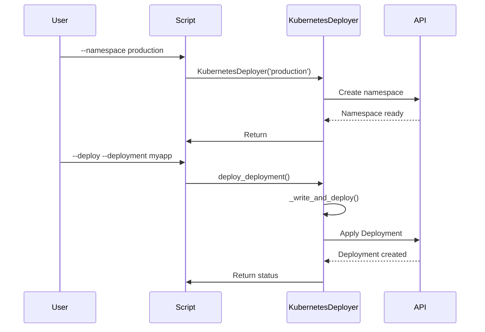

# k8s_deploy.py

## Overview

The `k8s_deploy.py` script manages Kubernetes deployments, services, and configurations. It provides automated deployment of applications with support for deployments, services, ConfigMaps, and Secrets.

## Features

- Kubernetes deployment management
- Service creation (ClusterIP, NodePort, LoadBalancer)
- ConfigMap and Secret management
- Namespace support
- YAML manifest generation
- Deployment monitoring

## Mermaid Diagram



## Usage

### Deploy a Deployment

```bash
python scripts/k8s_deploy.py \
    --namespace production \
    --deploy \
    --deployment myapp \
    --image myapp:latest \
    --replicas 3 \
    --port 8080
```

### Create a Service

```bash
python scripts/k8s_deploy.py \
    --namespace production \
    service \
    --name web-service \
    --target myapp \
    --port 80 \
    --type LoadBalancer
```

### Create a ConfigMap

```bash
python scripts/k8s_deploy.py \
    --namespace production \
    configmap \
    --name app-config \
    --data \
    DATABASE_URL=postgres://db:5432 \
    API_URL=https://api.example.com
```

### Create a Secret

```bash
python scripts/k8s_deploy.py \
    --namespace production \
    secret \
    --name db-secret \
    --data \
    username=admin \
    password=secret123
```

### Apply from File

```bash
python scripts/k8s_deploy.py \
    --namespace production \
    --deploy \
    --manifest k8s/deployment.yaml
```

## Commands

### Deploy

```bash
python scripts/k8s_deploy.py \
    --namespace production \
    --deploy \
    --deployment myapp \
    --image nginx:latest \
    --replicas 3
```

### Service

```bash
python scripts/k8s_deploy.py \
    --namespace production \
    service \
    --name api-service \
    --target myapp \
    --port 8080
```

### ConfigMap

```bash
python scripts/k8s_deploy.py \
    --namespace production \
    configmap \
    --name app-config \
    --data key1=value1 key2=value2
```

### Secret

```bash
python scripts/k8s_deploy.py \
    --namespace production \
    secret \
    --name secret-credentials \
    --data username=user password=pass
```

## Architecture



## Workflow



## Configuration

### Environment Variables

- `KUBERNETES_NAMESPACE`: Default namespace (default: 'default')

### YAML Manifest Example

```yaml
apiVersion: apps/v1
kind: Deployment
metadata:
  name: myapp
  namespace: production
spec:
  replicas: 3
  selector:
    matchLabels:
      app: myapp
  template:
    metadata:
      labels:
        app: myapp
    spec:
      containers:
        - name: myapp
          image: myapp:latest
          ports:
            - containerPort: 8080
          env:
            - name: ENV
              value: production
```

## Types of Services

### ClusterIP
Default service type for internal communication
```bash
python scripts/k8s_deploy.py service --name svc --target myapp --port 80 --type ClusterIP
```

### NodePort
Service accessible from outside cluster
```bash
python scripts/k8s_deploy.py service --name svc --target myapp --port 80 --type NodePort
```

### LoadBalancer
External load balancer for production
```bash
python scripts/k8s_deploy.py service --name svc --target myapp --port 80 --type LoadBalancer
```

## Return Codes

- `0`: Success
- `1`: Error

## Dependencies

- Python 3.7+
- kubectl
- Kubernetes cluster access
- PyYAML

## Examples

### Complete Deployment

```bash
# Create namespace
python scripts/k8s_deploy.py \
    --namespace production \
    --deploy \
    --deployment api-server \
    --image api-server:latest \
    --replicas 5 \
    --port 8080 \
    --env DATABASE_URL=postgres://db:5432 \
    --env ENVIRONMENT=production

# Create service
python scripts/k8s_deploy.py \
    --namespace production \
    service \
    --name api-service \
    --target api-server \
    --port 80

# Create configmap
python scripts/k8s_deploy.py \
    --namespace production \
    configmap \
    --name app-config \
    --data \
    DATABASE_URL=postgres://db:5432 \
    API_TIMEOUT=30
```

## Best Practices

1. **Use namespaces** to organize resources
2. **Always specify** image tags for reproducibility
3. **Use environment variables** for configuration
4. **Test manifests** before applying
5. **Monitor deployment** status after creation
