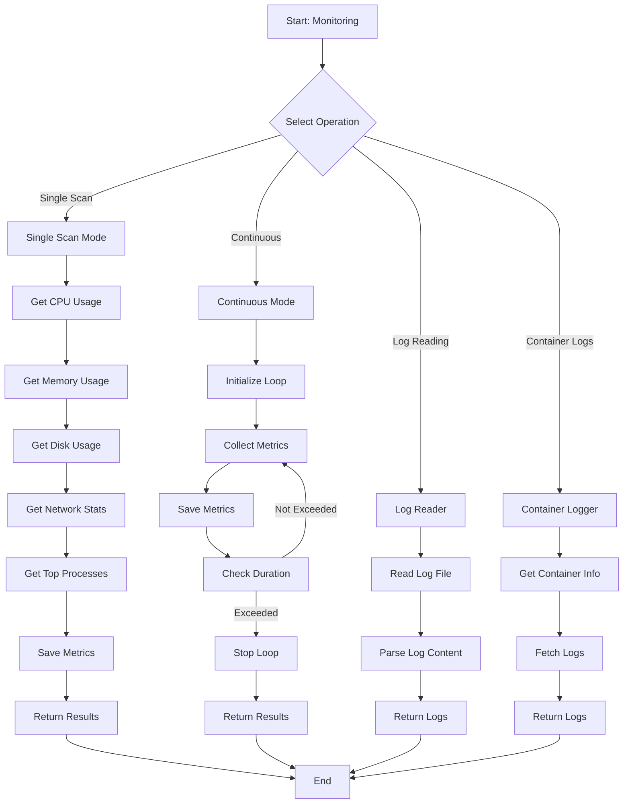
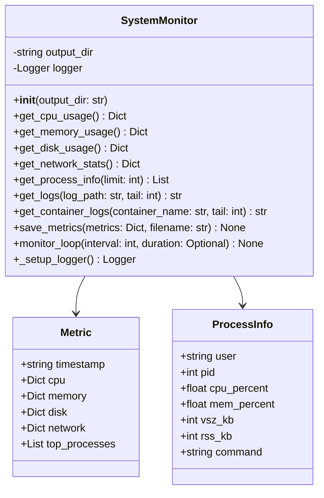
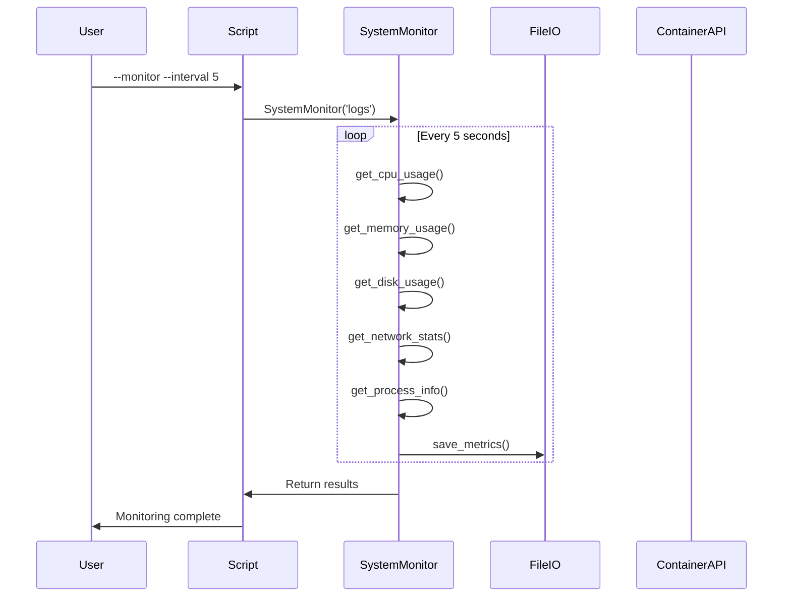

# monitoring.py

## Overview

The `monitoring.py` script provides comprehensive system and container monitoring capabilities. It collects CPU, memory, disk, network statistics and container logs with support for continuous monitoring and metric export.

## Features

- System resource monitoring (CPU, memory, disk, network)
- Process information
- Docker container log collection
- Continuous monitoring loop
- JSON metrics export
- Log file reading
- Customizable intervals

## Mermaid Diagram



## Usage

### Single Scan

```bash
python scripts/monitoring.py
```

### Continuous Monitoring

```bash
python scripts/monitoring.py \
    --monitor \
    --interval 5 \
    --duration 300
```

### Get System Logs

```bash
python scripts/monitoring.py \
    --log /var/log/syslog \
    --tail 100
```

### Get Container Logs

```bash
python scripts/monitoring.py \
    --container nginx \
    --tail 100
```

### Save Metrics

```bash
python scripts/monitoring.py \
    --save \
    --interval 10 \
    --duration 60
```

### Get Container Info

```bash
python scripts/monitoring.py \
    --container nginx
```

## Commands

### Monitor

```bash
python scripts/monitoring.py \
    --monitor \
    --interval 5 \
    --duration 300
```

### Get Logs

```bash
python scripts/monitoring.py \
    --log /var/log/app.log \
    --tail 50
```

### Get Container Logs

```bash
python scripts/monitoring.py \
    --container container-name \
    --tail 100
```

### Save Metrics

```bash
python scripts/monitoring.py \
    --save \
    --interval 10
```

## Architecture



## Workflow



## Metrics Collected

### CPU Usage
- User time
- Nice time
- System time
- Idle time
- I/O wait
- IRQ time
- Soft IRQ time
- Steal time

### Memory Usage
- Total MB
- Used MB
- Free MB
- Shared MB
- Buffers MB
- Cache MB
- Available MB

### Disk Usage
- Filesystem
- Size
- Used
- Available
- Use percentage
- Mount point

### Network Stats
- Interface name
- IP address
- State

### Process Info
- User
- PID
- CPU percentage
- Memory percentage
- VSZ (Virtual Size)
- RSS (Resident Set)
- TTY
- State
- Start time
- Elapsed time
- Command

## Configuration

### Output Directory

```bash
--output logs
```

### Log File Path

```bash
--log /var/log/app.log
```

### Container Name

```bash
--container nginx
```

### Interval

```bash
--interval 5
```

### Duration

```bash
--duration 300
```

### Tail Lines

```bash
--tail 100
```

## Return Codes

- `0`: Success
- `1`: Error

## Dependencies

- Python 3.7+
- Linux/Unix system
- Docker (for container logs)

## Examples

### Basic Monitoring

```bash
# Single scan
python scripts/monitoring.py

# Continuous monitoring
python scripts/monitoring.py \
    --monitor \
    --interval 5 \
    --duration 60
```

### Log Monitoring

```bash
# System log
python scripts/monitoring.py \
    --log /var/log/syslog \
    --tail 100

# Application log
python scripts/monitoring.py \
    --log /var/log/app.log \
    --tail 50
```

### Container Monitoring

```bash
# Get container logs
python scripts/monitoring.py \
    --container nginx \
    --tail 100

# Get container info
python scripts/monitoring.py \
    --container nginx
```

### Metrics Export

```bash
# Continuous monitoring with metric saving
python scripts/monitoring.py \
    --monitor \
    --interval 10 \
    --duration 300 \
    --save
```

## Output Files

### Metrics JSON

```json
{
  "timestamp": "2023-01-15T10:30:45.123456",
  "cpu": {
    "user": 25.5,
    "system": 15.2,
    "idle": 50.3,
    "iowait": 5.0
  },
  "memory": {
    "total_mb": 16384,
    "used_mb": 8192,
    "free_mb": 4096,
    "available_mb": 10240
  },
  "disk": {
    "filesystems": [
      {
        "device": "/dev/sda1",
        "size": "100G",
        "used": "60G",
        "available": "35G",
        "use_percent": "60%"
      }
    ]
  },
  "network": {
    "interfaces": {
      "eth0": {
        "address": "192.168.1.100",
        "state": "UP"
      }
    }
  },
  "top_processes": [
    {
      "user": "root",
      "pid": 1234,
      "cpu_percent": 5.2,
      "mem_percent": 2.1,
      "command": "/usr/sbin/nginx"
    }
  ]
}
```

## Best Practices

1. **Monitor regularly** for early issue detection
2. **Set appropriate intervals** to balance overhead and visibility
3. **Save metrics** for trend analysis
4. **Monitor container logs** for application issues
5. **Use custom output directories** for organization
6. **Review system logs** for security events
