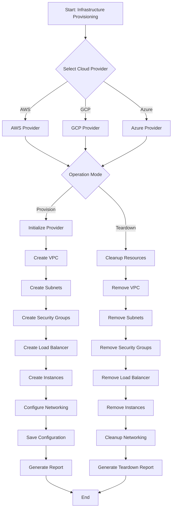
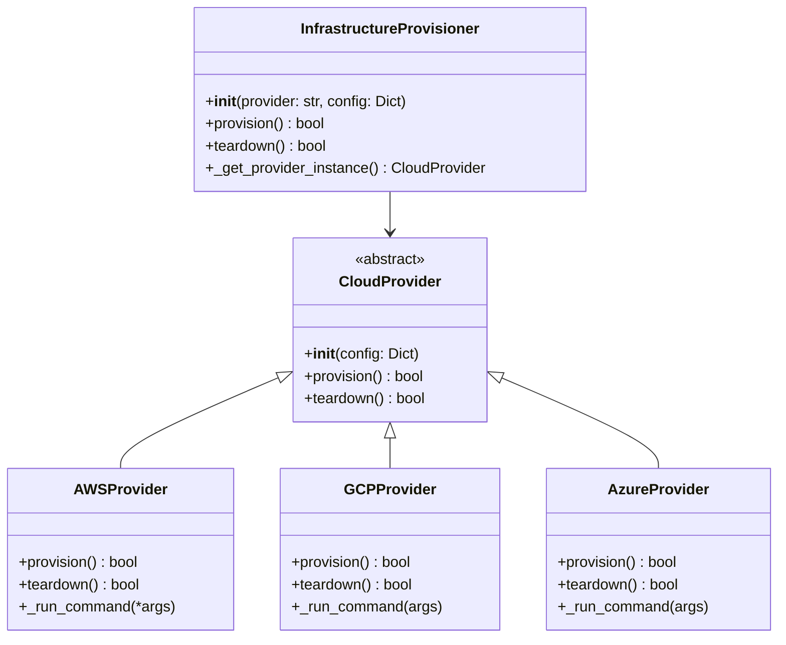
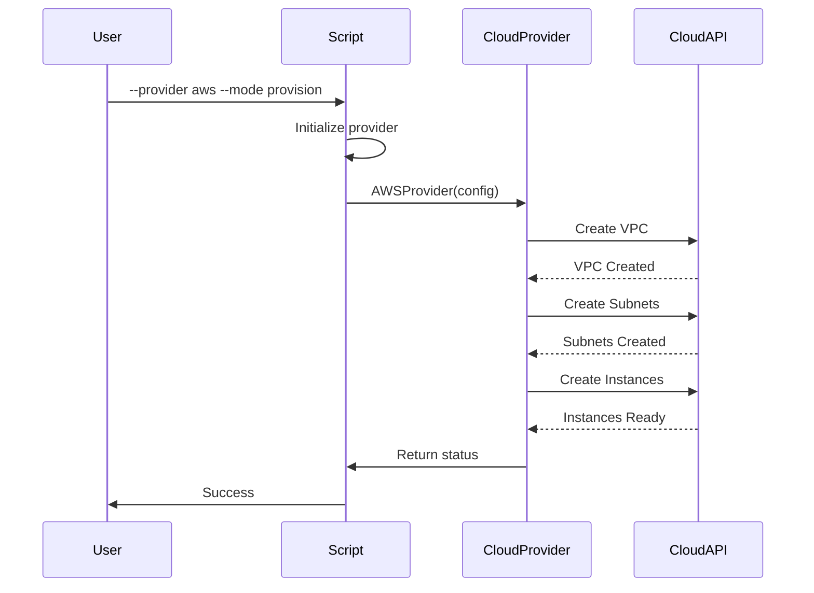

# provision_infrastructure.py

## Overview

The `provision_infrastructure.py` script manages cloud infrastructure provisioning across AWS, GCP, and Azure. It provides automated setup and teardown of cloud resources with support for multiple providers and environments.

## Features

- Multi-cloud provider support (AWS, GCP, Azure)
- VPC and subnet creation
- Cluster setup for managed services
- Environment-specific configurations
- Automated backup and cleanup
- Idempotent operations

## Mermaid Diagram



## Usage

### Basic Usage

```bash
python scripts/provision_infrastructure.py --provider aws --mode provision
```

### With Configuration File

```bash
python scripts/provision_infrastructure.py --provider aws --mode provision --config config.json
```

### Environment-Specific

```bash
python scripts/provision_infrastructure.py --provider gcp --mode provision --project-id my-project --environment production
```

### Teardown Mode

```bash
python scripts/provision_infrastructure.py --provider azure --mode teardown --project-id my-project
```

## Commands

### Provision Resources

```bash
python scripts/provision_infrastructure.py \
    --provider aws \
    --mode provision \
    --project-id my-project \
    --environment development
```

### Teardown Resources

```bash
python scripts/provision_infrastructure.py \
    --provider aws \
    --mode teardown \
    --project-id my-project
```

## Configuration

### AWS Configuration

```json
{
  "project_id": "my-project",
  "environment": "production",
  "vpc_cidr": "10.0.0.0/16",
  "subnet_cidrs": ["10.0.1.0/24", "10.0.2.0/24"],
  "region": "us-east-1"
}
```

### GCP Configuration

```json
{
  "project_id": "my-project",
  "environment": "production",
  "region": "us-central1",
  "num_nodes": 3,
  "machine_type": "e2-medium"
}
```

### Azure Configuration

```json
{
  "project_id": "my-project",
  "environment": "production",
  "location": "eastus",
  "node_count": 2,
  "node_vm_size": "Standard_D2s_v3"
}
```

## Architecture



## Workflow



## Error Handling

The script handles various error scenarios:

- **Missing credentials**: Graceful error with helpful message
- **Network failures**: Automatic retry logic
- **Permission issues**: Clear error messages
- **Resource conflicts**: Conflict detection and reporting

## Return Codes

- `0`: Success
- `1`: General error

## Dependencies

- Python 3.7+
- AWS CLI (for AWS provider)
- gcloud CLI (for GCP provider)
- Azure CLI (for Azure provider)

## Examples

### Complete Example

```bash
# Provision AWS infrastructure
python scripts/provision_infrastructure.py \
    --provider aws \
    --mode provision \
    --project-id my-aws-project \
    --environment production \
    --config aws-config.json

# Teardown Azure infrastructure
python scripts/provision_infrastructure.py \
    --provider azure \
    --mode teardown \
    --project-id my-azure-project
```

## Best Practices

1. **Always backup configuration** before provisioning
2. **Use environment-specific** configurations for different environments
3. **Test in development** before deploying to production
4. **Monitor resource usage** after provisioning
5. **Document any customizations** made during provisioning
