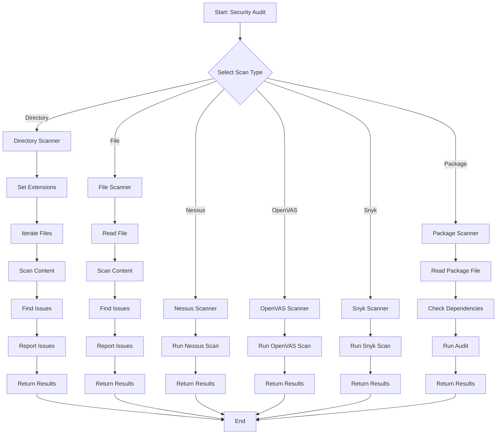
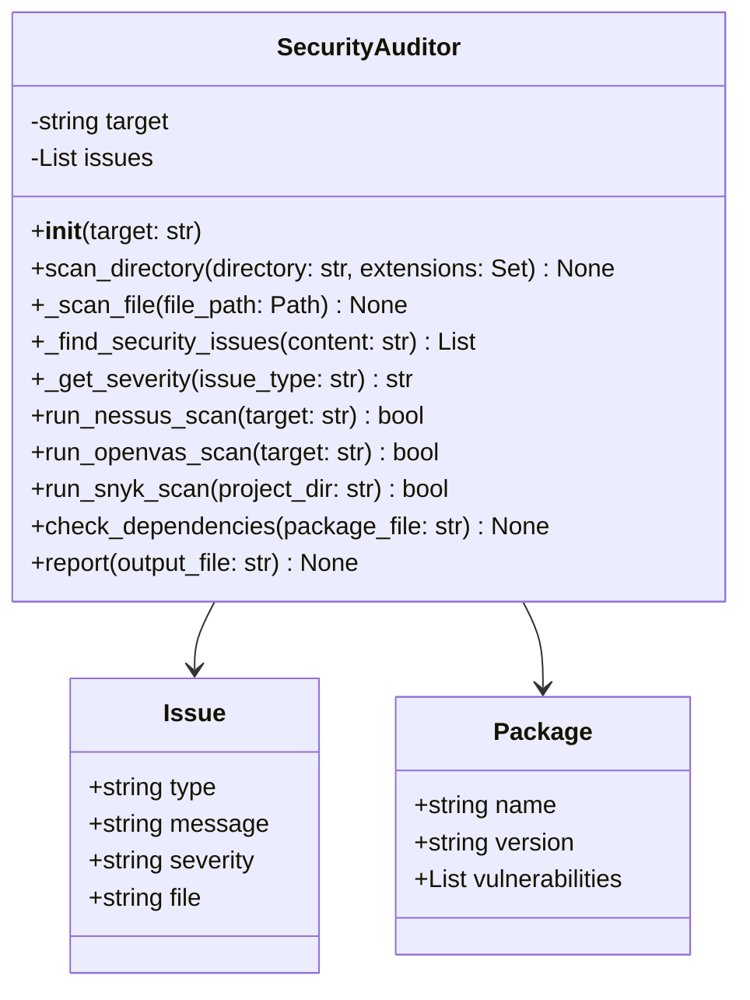
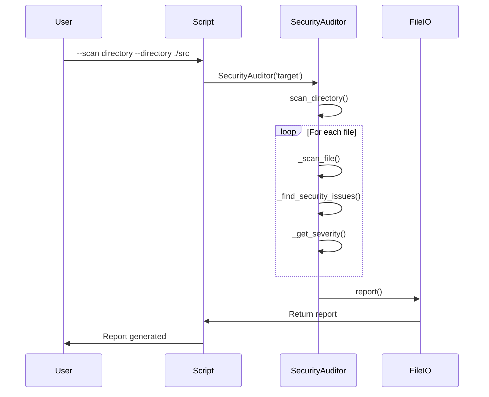

# security_audit.py

## Overview

The `security_audit.py` script provides comprehensive security auditing and vulnerability scanning capabilities. It detects hardcoded secrets, SQL injection vulnerabilities, code injection risks, and weak security configurations.

## Features

- Security issue detection
- Hardcoded secrets scanning
- SQL injection vulnerability checks
- Code injection detection
- Weak hashing algorithm detection
- Directory scanning
- File-based auditing
- Report generation

## Mermaid Diagram



## Usage

### Directory Scan

```bash
python scripts/security_audit.py \
    --scan directory \
    --directory ./src \
    --report security_report.json
```

### File Scan

```bash
python scripts/security_audit.py \
    --scan file \
    --file src/main.py \
    --report report.json
```

### Security Scan

```bash
python scripts/security_audit.py \
    --scan directory \
    --directory . \
    --report security_report.json
```

### Package Scan

```bash
python scripts/security_audit.py \
    --package package.json \
    --report dependencies.json
```

### Specific File

```bash
python scripts/security_audit.py \
    --scan file \
    --file config.py \
    --report config_report.json
```

## Commands

### Directory Scan

```bash
python scripts/security_audit.py \
    --scan directory \
    --directory ./src
```

### File Scan

```bash
python scripts/security_audit.py \
    --scan file \
    --file config.py
```

### Nessus Scan

```bash
python scripts/security_audit.py \
    --nessus \
    --target https://example.com
```

### OpenVAS Scan

```bash
python scripts/security_audit.py \
    --openvas \
    --target https://example.com
```

### Snyk Scan

```bash
python scripts/security_audit.py \
    --snyk \
    --directory ./src
```

### Package Scan

```bash
python scripts/security_audit.py \
    --package package.json
```

## Architecture



## Workflow



## Security Issues Detected

### Hardcoded Secrets

- API keys
- Database passwords
- Secret tokens
- Authentication tokens
- Private keys

### SQL Injection

- SELECT * patterns
- User input in queries
- Dynamic queries
- Unsafe concatenation

### Code Injection

- eval() usage
- exec() usage
- System command execution
- Shell injection

### Weak Security

- MD5/SHA1 hashing
- Weak encryption
- Hardcoded credentials
- Unvalidated input

## Scanned File Types

- Python (.py)
- JavaScript (.js, .ts)
- Java (.java)
- Go (.go)
- Ruby (.rb)
- PHP (.php)
- Shell (.sh)
- Configuration files (.env, .config)

## Extensions

```python
extensions = {'.py', '.js', '.ts', '.java', '.go', '.rb', '.php', '.sh'}
```

## Severity Levels

- **HIGH**: Critical security issues
- **MEDIUM**: Potential security risks
- **LOW**: Minor security concerns

## Report Format

### JSON Report

```json
{
  "summary": {
    "total_issues": 10,
    "high": 3,
    "medium": 5,
    "low": 2
  },
  "issues": [
    {
      "type": "hardcoded_secret",
      "message": "Potential hardcoded API key found",
      "severity": "HIGH",
      "file": "config.py"
    },
    {
      "type": "sql_injection",
      "message": "Potential SQL injection vulnerability",
      "severity": "HIGH",
      "file": "database.py"
    }
  ]
}
```

## Return Codes

- `0`: Success
- `1`: Error

## Dependencies

- Python 3.7+
- Optional: nessus-cli
- Optional: gvm-cli
- Optional: snyk

## Examples

### Basic Scan

```bash
# Scan directory for security issues
python scripts/security_audit.py \
    --scan directory \
    --directory ./src
```

### File Scan

```bash
# Scan specific file
python scripts/security_audit.py \
    --scan file \
    --file config.py
```

### Package Scan

```bash
# Scan package.json for vulnerabilities
python scripts/security_audit.py \
    --package package.json
```

### Comprehensive Scan

```bash
# Run all scanners
python scripts/security_audit.py \
    --scan directory \
    --directory . \
    --report security_report.json
```

### External Scanners

```bash
# Run Nessus scan
python scripts/security_audit.py \
    --nessus \
    --target https://example.com

# Run OpenVAS scan
python scripts/security_audit.py \
    --openvas \
    --target https://example.com

# Run Snyk scan
python scripts/security_audit.py \
    --snyk \
    --directory ./src
```

## Best Practices

1. **Scan regularly** to catch new vulnerabilities
2. **Review all issues** before deployment
3. **Fix high-severity issues** immediately
4. **Use environment variables** for secrets
5. **Test inputs** against injection vectors
6. **Keep dependencies** up to date
7. **Use secure hashing** algorithms
8. **Review logs** for suspicious activity

## Issue Examples

### Hardcoded Secret Example

```python
# BAD
api_key = 'secret123'

# GOOD
api_key = os.getenv('API_KEY')
```

### SQL Injection Example

```python
# BAD
cursor.execute(f"SELECT * FROM users WHERE id = {user_id}")

# GOOD
cursor.execute("SELECT * FROM users WHERE id = %s", (user_id,))
```

### Code Injection Example

```python
# BAD
eval('malicious_code()')

# GOOD
# Use proper validation and sanitization
```
