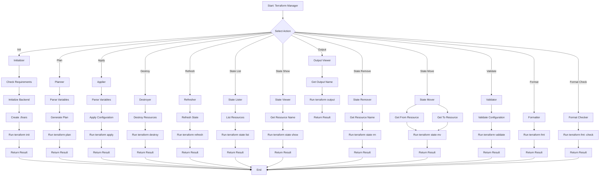
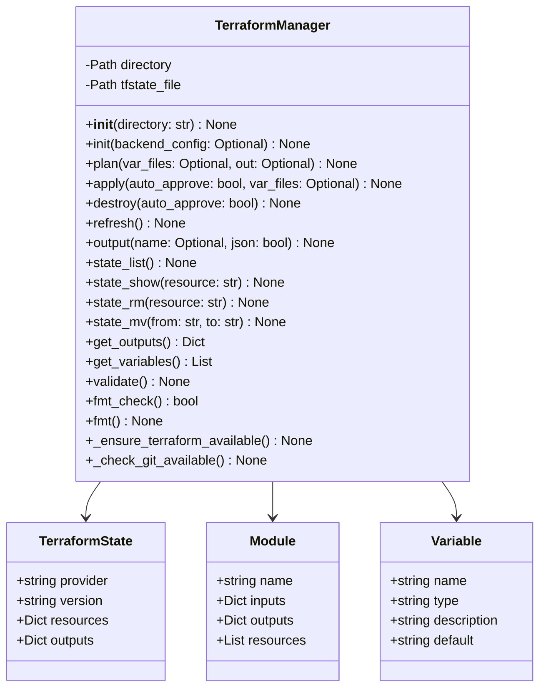
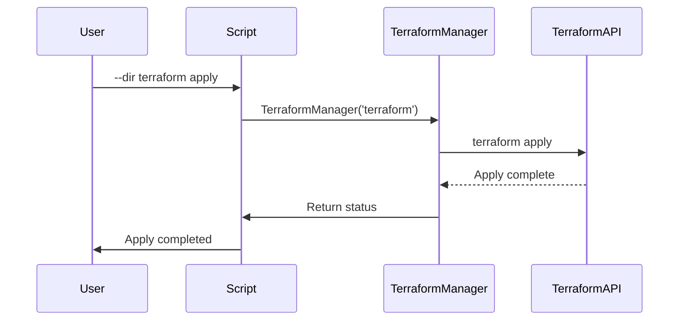

# terraform_manager.py

## Overview

The `terraform_manager.py` script provides Terraform configuration management. It handles the complete Terraform workflow including initialization, planning, applying, and destroying infrastructure.

## Features

- Terraform operations (init, plan, apply, destroy)
- State management
- Output viewing
- Configuration validation
- Format checking
- Resource listing

## Mermaid Diagram



## Usage

### Initialize

```bash
python scripts/terraform_manager.py \
    --dir terraform \
    init
```

### Initialize with Backend Config

```bash
python scripts/terraform_manager.py \
    --dir terraform \
    init \
    --backend-config backend-config.json
```

### Plan

```bash
python scripts/terraform_manager.py \
    --dir terraform \
    plan \
    --var-file variables.tfvars \
    --out plan.tfplan
```

### Apply

```bash
python scripts/terraform_manager.py \
    --dir terraform \
    apply \
    --auto-approve \
    --var-file variables.tfvars
```

### Destroy

```bash
python scripts/terraform_manager.py \
    --dir terraform \
    destroy \
    --auto-approve
```

### Refresh

```bash
python scripts/terraform_manager.py \
    --dir terraform \
    refresh
```

### Output

```bash
python scripts/terraform_manager.py \
    --dir terraform \
    output \
    --name db_endpoint \
    --json
```

### State List

```bash
python scripts/terraform_manager.py \
    --dir terraform \
    state list
```

### State Show

```bash
python scripts/terraform_manager.py \
    --dir terraform \
    state show \
    aws_instance.example
```

### State Remove

```bash
python scripts/terraform_manager.py \
    --dir terraform \
    state rm \
    aws_instance.example
```

### State Move

```bash
python scripts/terraform_manager.py \
    --dir terraform \
    state mv \
    aws_old.example \
    aws_new.example
```

### Validate

```bash
python scripts/terraform_manager.py \
    --dir terraform \
    validate
```

### Format

```bash
python scripts/terraform_manager.py \
    --dir terraform \
    fmt
```

### Format Check

```bash
python scripts/terraform_manager.py \
    --dir terraform \
    fmt-check
```

## Commands

### Init

```bash
python scripts/terraform_manager.py \
    --dir terraform \
    init
```

### Plan

```bash
python scripts/terraform_manager.py \
    --dir terraform \
    plan \
    --var-file variables.tfvars
```

### Apply

```bash
python scripts/terraform_manager.py \
    --dir terraform \
    apply \
    --auto-approve
```

### Destroy

```bash
python scripts/terraform_manager.py \
    --dir terraform \
    destroy
```

### Output

```bash
python scripts/terraform_manager.py \
    --dir terraform \
    output
```

### State List

```bash
python scripts/terraform_manager.py \
    --dir terraform \
    state list
```

## Architecture



## Workflow



## Terraform Files

### main.tf

```hcl
terraform {
  required_version = ">= 1.0.0"
  required_providers {
    aws = {
      source  = "hashicorp/aws"
      version = "~> 4.0"
    }
  }
}

provider "aws" {
  region = "us-east-1"
}

resource "aws_instance" "example" {
  ami           = "ami-0c55b159cbfafe1f0"
  instance_type = "t2.micro"

  tags = {
    Name = "example-instance"
  }
}
```

### variables.tf

```hcl
variable "region" {
  description = "AWS region"
  type        = string
  default     = "us-east-1"
}

variable "instance_type" {
  description = "EC2 instance type"
  type        = string
  default     = "t2.micro"
}
```

### outputs.tf

```hcl
output "instance_id" {
  description = "The ID of the instance"
  value       = aws_instance.example.id
}

output "public_ip" {
  description = "The public IP address"
  value       = aws_instance.example.public_ip
}
```

## Return Codes

- `0`: Success
- `1`: Error

## Dependencies

- Python 3.7+
- Terraform 1.0+
- Docker (if using remote state)

## Examples

### Complete Terraform Workflow

```bash
# Initialize
python scripts/terraform_manager.py \
    --dir terraform \
    init

# Validate
python scripts/terraform_manager.py \
    --dir terraform \
    validate

# Plan
python scripts/terraform_manager.py \
    --dir terraform \
    plan

# Apply
python scripts/terraform_manager.py \
    --dir terraform \
    apply \
    --auto-approve

# View outputs
python scripts/terraform_manager.py \
    --dir terraform \
    output

# Refresh
python scripts/terraform_manager.py \
    --dir terraform \
    refresh

# Format
python scripts/terraform_manager.py \
    --dir terraform \
    fmt

# Format check
python scripts/terraform_manager.py \
    --dir terraform \
    fmt-check

# List state
python scripts/terraform_manager.py \
    --dir terraform \
    state list

# State show
python scripts/terraform_manager.py \
    --dir terraform \
    state show aws_instance.example

# State remove
python scripts/terraform_manager.py \
    --dir terraform \
    state rm aws_instance.example

# Destroy
python scripts/terraform_manager.py \
    --dir terraform \
    destroy \
    --auto-approve
```

## Best Practices

1. **Use versions** - Pin Terraform and provider versions
2. **Organize files** - Separate main, variables, outputs
3. **Use modules** - Reusable infrastructure components
4. **Remote state** - Use S3 or similar for state storage
5. **Validate** - Always validate before apply
6. **Review plan** - Review plan output before applying
7. **Format** - Keep code formatted with terraform fmt
8. **State management** - Backup state before destructive operations
9. **Workflows** - Use terraform workspaces for environments
10. **Backend config** - Configure backend properly
